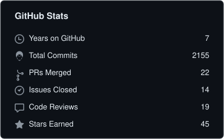
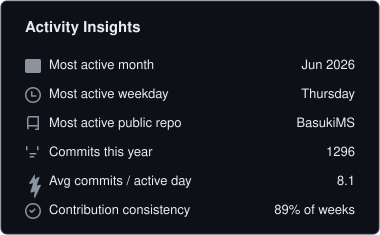
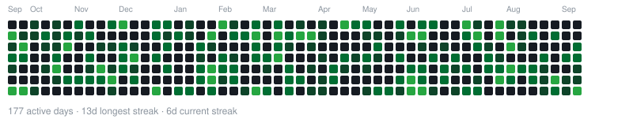

# Sajag Silwal

`engineer` · `builder` · `finance student`

**Building systems. Studying markets.  
Exploring what happens when the two meet.**

Shenzhen, China

[Website ↗](https://sajagsilwal.com) &nbsp;&nbsp; [Writing ↗](https://sajagsilwal.com/writing) &nbsp;&nbsp; [GitHub ↗](https://github.com/sajagsilwal123) &nbsp;&nbsp; [Email ↗](mailto:contact@sajagsilwal.com)

 

> currently → Master's in Finance @ **Peking University HSBC Business School (PHBS)**

 

I'm a computer engineer from Nepal — I started out building backend systems, products and software around real operational problems.

I'm now pursuing a Master's in Finance at Peking University HSBC Business School in Shenzhen, while exploring markets, quantitative finance and the places where computation meets finance.

---

## 01 / Building

### BasukiMS

Fleet resource planning and operational software for a logistics business.

`fleet` `operations` `accounting` `inventory` `analytics`

### Dhewa

An end-to-end experiment in pushing the limits of AI in software engineering, exploring how much of the software lifecycle can be designed, built, tested, refined, and automated with AI as an active engineering collaborator.

`ai` `software engineering` `experimentation` `automation` `developer tooling`

### Aroma & Nexus

Connected product and operations work under Iruka Technologies, covering e-commerce, inventory, vendor operations, fulfilment, warehouse workflows, dispatch, tracking, replenishment, and automation.

`e-commerce` `operations` `inventory` `fulfilment` `automation`

 

## 02 / Exploring

`quant finance` · `markets` · `econometrics` · `risk`

`fintech` · `market microstructure` · `investment research` · `data`

 

### Exploring the potential of AI in software engineering

Active experimentation around how AI can improve software development, engineering workflows, automation, code assistance, system design, debugging, and developer productivity.

`developer productivity` · `code assistance` · `workflows` · `system design` · `debugging`

 

## 03 / Toolkit

<strong>Build</strong>

<table width="100%">
  <tr>
    <td width="50%">&nbsp;&nbsp;TypeScript</td>
    <td width="50%">&nbsp;&nbsp;Node.js</td>
  </tr>
  <tr>
    <td width="50%">&nbsp;&nbsp;Next.js</td>
    <td width="50%">&nbsp;&nbsp;PostgreSQL</td>
  </tr>
  <tr>
    <td width="50%">&nbsp;&nbsp;Redis</td>
    <td width="50%">&nbsp;</td>
  </tr>
</table>

<strong>Ship</strong>

<table width="100%">
  <tr>
    <td width="50%">&nbsp;&nbsp;Docker</td>
    <td width="50%">&nbsp;&nbsp;Nginx</td>
  </tr>
  <tr>
    <td width="50%">&nbsp;&nbsp;Linux</td>
    <td width="50%">&nbsp;&nbsp;GitHub</td>
  </tr>
</table>

<strong>Deployment & Cloud</strong>

<table width="100%">
  <tr>
    <td width="50%">&nbsp;&nbsp;DigitalOcean</td>
    <td width="50%">&nbsp;&nbsp;Vercel</td>
  </tr>
  <tr>
    <td width="50%">&nbsp;&nbsp;AWS</td>
    <td width="50%">&nbsp;</td>
  </tr>
</table>

<strong>Also</strong>

<table width="100%">
  <tr>
    <td width="50%">&nbsp;&nbsp;Java</td>
    <td width="50%">&nbsp;&nbsp;Python</td>
  </tr>
  <tr>
    <td width="50%">&nbsp;&nbsp;MongoDB</td>
    <td width="50%">&nbsp;</td>
  </tr>
</table>

<strong>AI</strong>

<table width="100%">
  <tr>
    <td width="50%">&nbsp;&nbsp;ChatGPT</td>
    <td width="50%">&nbsp;&nbsp;Claude</td>
  </tr>
  <tr>
    <td width="50%">&nbsp;&nbsp;Gemini</td>
    <td width="50%">&nbsp;&nbsp;Kimi</td>
  </tr>
  <tr>
    <td width="50%">&nbsp;&nbsp;Qwen</td>
    <td width="50%">&nbsp;</td>
  </tr>
</table>

---

## 04 / GitHub

### things I've been building lately.

 

&nbsp;

 
 

Languages reflect code composition across public & private repositories, not proficiency.

 

## 05 / Writing

Ideas worth thinking through.

Notes on finance, technology, markets, engineering — and whatever else I find worth writing about.

[Read my notes ↗](https://sajagsilwal.com/writing)

 

## 06 / Elsewhere

[Website ↗](https://sajagsilwal.com)  
[Writing ↗](https://sajagsilwal.com/writing)  
[GitHub ↗](https://github.com/sajagsilwal123)  
[Email ↗](mailto:contact@sajagsilwal.com)

 

**say hello → [contact@sajagsilwal.com](mailto:contact@sajagsilwal.com)**

 

building systems · studying markets · figuring out what connects them

